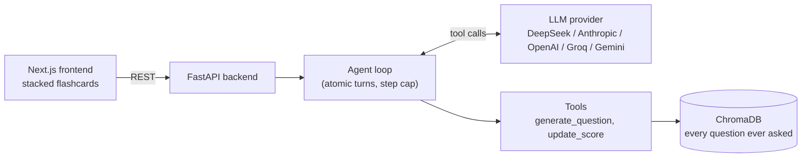

# Trivia Master

An AI-hosted trivia game that never asks the same question twice, even reworded, even across games.

**Live demo: [main.d286bzw86yrw57.amplifyapp.com](https://main.d286bzw86yrw57.amplifyapp.com/)** (demo limits apply, so it may ask you to try a shorter game or come back tomorrow)

Pick a topic per round. An LLM agent writes the questions, marks your answers (typos and short forms are fine) and keeps score. Every new question is checked against a vector database of everything asked before. Game rules run in code, not the prompt, so the model can't skip a question, score twice or repeat itself.

<p align="center">
  
  
</p>

## Results

From [`eval_game.py`](backend/eval_game.py): full games with the real agent and a simulated player who answers correctly, with typos, or wrongly. DeepSeek V4.1 Flash (thinking mode), 5 rounds x 20 questions, fresh memory.

| Metric | Result |
|---|---|
| Questions completed | **100 / 100**, 0 failed turns |
| Answer marking | **100 / 100** (39/39 correct, **17/17 typos** accepted, 44/44 wrong rejected) |
| Repeats that reached the player | **0** |
| Model calls per question | 1.38 |
| Time per turn | 3.5 s average |
| Cost | $0.0018 per question, about $0.18 for a 100-question game (before cache discounts) |

- **Duplicate check:** on 20 labelled question pairs, the best plain embedding cutoff caught 8/10 repeats with 1/10 false alarms. The hybrid rule below catches **10/10 with 0/10**.
- **Question accuracy:** thinking mode cut wrong questions from about 5 in 9 to 0 in 11, for about 2 s more per turn.

### Memory vs cost

Sending the whole round's history to the model made input grow every turn. I tested three ways of giving the model memory (same eval, same seed):

| Version | Cost per question | Rejected repeats | Calls per question | Time per turn |
|---|---|---|---|---|
| Full history | $0.0026 | 10 | 1.2 | 2.9 s |
| Last 2 turns only | $0.0019 | 42 (avg of 2 runs) | 1.6 | 3.9 s |
| **Last 2 turns + list of past questions** (current) | **$0.0018** | 25 | 1.38 | 3.5 s |

Cutting history halved input tokens, but the model forgot its earlier questions and kept proposing them again. The server blocked every repeat, so each one cost an extra call. Adding a compact list of past questions (about 20 tokens each) brought back most of that memory. The current version is **30% cheaper** than full history; the trade-off is more retries and slightly slower turns. Details in [DEVLOG bug 14](DEVLOG.md).

Single runs on one model: indicative, not benchmarks.

## How it works



1. **Rounds:** 1 to 5 rounds, 3 to 20 questions each, a topic per round.
2. **Each turn is one agent loop.** The model calls `update_score` (with a reaction) and `generate_question` (next question and hidden answer), usually in one reply.
3. **The server holds the truth.** Score, the hidden answer and round progress live in game state and are put in the system prompt, so marking is always against the stored answer.
4. **Memory:** each accepted question is embedded with its answer in ChromaDB. A new question is checked against the 5 nearest.

## Engineering decisions

- **Rules in code, not the prompt.** Logs showed the model ignoring prompt rules (repeats, scoring unseen questions). Each is now a tool check that returns an error the model can react to.
- **Hybrid duplicate rule.** Embedding distance alone overlapped: some rewordings were far apart, some different questions were close. Every real repeat shared its answer, so a repeat is **same answer and distance < 0.46**, or **nearly identical (< 0.05)**. Tuned with [`tune_threshold.py`](backend/tune_threshold.py).
- **Context engineering.** A `check_answer` tool was removed because the model ignored its result. The model gets the questions and answers already used on the topic instead, and the eval showed what memory it actually needs (see Memory vs cost).
- **Atomic turns.** If a turn fails halfway, game state is restored so the player can retry.
- **Provider-neutral LLM layer.** Two hand-written adapters (Anthropic Messages API, OpenAI chat format for OpenAI, DeepSeek, Groq, Gemini) behind one interface. One env variable switches provider.
- **Safe to put online.** Per-visitor and daily question limits are checked before a game starts, so strangers can't run up the LLM bill. The backend runs in Docker on EC2 behind Caddy (automatic HTTPS); the frontend is static files on Amplify.
- **CI/CD.** Every push that touches the backend runs the test suite in GitHub Actions; if it passes, the workflow SSHes into EC2, rebuilds the containers and checks `/health` on the live site. Frontend pushes redeploy through Amplify.
- **Tested without API calls.** 102 pytest tests with a fake LLM, including replays of real failures.

Every bug, with cause and fix, is in [DEVLOG.md](DEVLOG.md).

## Tech stack

**Frontend:** Next.js 16, React 19, TypeScript, Tailwind CSS 4
**Backend:** Python 3.11, FastAPI, Pydantic
**AI:** tool-calling LLM agent, ChromaDB with all-MiniLM-L6-v2 embeddings
**Testing:** pytest, Playwright
**DevOps:** Docker, Docker Compose, AWS EC2, AWS Amplify, Caddy, GitHub Actions (CI/CD)

## Run it locally

Requires Python 3.11+, Node 20+ and an API key for one provider.

```bash
# backend
cd backend
python -m venv venv
venv\Scripts\activate            # macOS/Linux: source venv/bin/activate
pip install -r requirements.txt
copy .env.example .env           # macOS/Linux: cp; then set LLM_PROVIDER and its key
python sanity_check.py           # checks the LLM and ChromaDB
uvicorn main:app --reload        # http://127.0.0.1:8000/docs

# frontend (second terminal)
cd frontend
npm install
npm run dev                      # http://localhost:3000
```

Or run everything with Docker (after creating `backend/.env`):

```bash
docker compose up --build        # frontend http://localhost:3000, backend http://localhost:8000
```

The question memory lives in a Docker volume, so it survives restarts and rebuilds. Deploying to AWS (EC2 + Amplify) is covered in [docs/DEPLOY.md](docs/DEPLOY.md).

From `backend/`: `pytest` (tests), `python eval_game.py --games 3` (auto-play and measure), `python tune_threshold.py` (check the duplicate rule).

## Status

- [x] Agent loop, tools and server-side rules
- [x] Multi-provider LLM layer
- [x] ChromaDB memory with a tuned duplicate rule (cutoff 0.46)
- [x] Rounds and flashcard UI
- [x] Evaluation script
- [x] Trim conversation history
- [x] Compact list of past questions in the prompt
- [x] Docker and docker-compose
- [x] Deploy (AWS EC2 backend, AWS Amplify frontend) with rate limiting
- [x] Live demo link
- [x] CI/CD with GitHub Actions (test, then redeploy the backend)

**Known limitations:** "inverse" questions are not treated as repeats ("What breed is Stella?" then "What is the French bulldog called?"). Question accuracy depends on the model.

## How I built this

Built with AI-assisted development (Claude Code). I made the product and architecture decisions: the provider-neutral design, moving rules from the prompt into code, the hybrid duplicate rule and the AWS plan. AI sped up scaffolding, UI, tests and boilerplate. I reviewed the core logic (agent loop, adapters, duplicate check) line by line. [CLAUDE.md](CLAUDE.md) holds the rules I gave the AI. Decisions came from game logs and measured runs.
