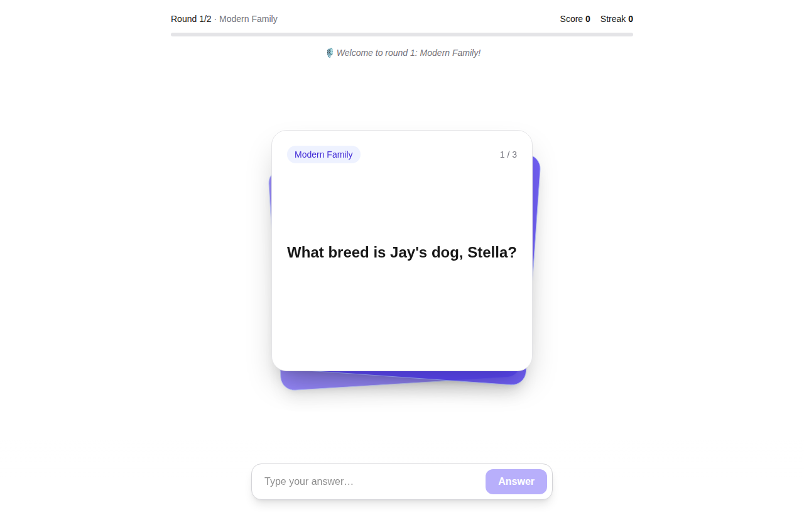
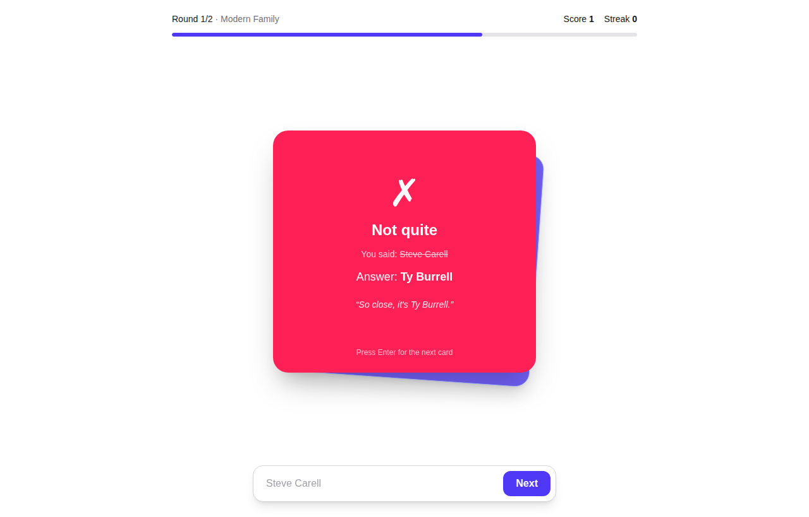
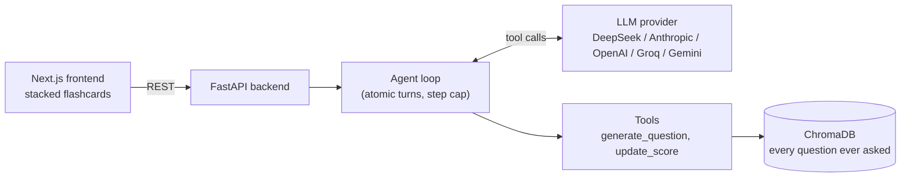

# Trivia Master

An AI-hosted trivia game that never asks the same question twice, even reworded, even across games.

Pick any topic for each round. An LLM agent writes the questions, marks your answers (typos and short forms are fine), keeps score, and checks every new question against a vector database of everything it has asked before. The game logic runs in code, not in the prompt, so the model can't skip a question, score twice, or repeat itself.

<p align="center">
  
  
</p>

## Results

Measured with [`eval_game.py`](backend/eval_game.py), which plays full games with the real agent and a simulated player who answers correctly, with deliberate typos, or wrongly. Run: DeepSeek V4.1 Flash with thinking mode, 5 rounds x 20 questions, fresh memory.

| Metric | Result |
|---|---|
| Questions completed | **100 / 100**, 0 failed turns |
| Model calls per question | **1.2** (most turns take one call; the rest is round starts and retries after a rejected repeat) |
| Answer marking | **100 / 100**: 42/42 correct answers accepted, **18/18 typos accepted**, 40/40 wrong answers rejected |
| Reworded repeats that got through | **0** |
| Repeats caught by the memory | 10 rejected: 8 real repeats, 2 false alarms (fix below) |
| Time per turn | 2.9 s average |
| Cost | about **$0.001 per question** at 5 questions per round, $0.0026 at 20 per round (upper bound, before cache discounts) |

Other numbers from building it:

- **Duplicate check:** on 20 labelled question pairs from real games, the best plain embedding cutoff caught 8/10 repeats with 1/10 false alarms. The hybrid rule below catches **10/10 with 0/10**. A 2-game acceptance test (29 questions, same topic) caught 7 repeats with 0 false rejections.
- **Question accuracy:** turning on the model's thinking mode cut wrong or self-contradicting questions from about 5 in 9 to 0 in 11, for about 2 extra seconds per turn.

These are single runs on one model, so treat them as indicative, not benchmarks.

## How it works



1. **Rounds.** Choose 1 to 5 rounds, 3 to 20 questions per round, and a topic per round (fewer topics repeat in order).
2. **Each turn is one agent loop.** The model calls `update_score` (with its reaction to your answer) and `generate_question` (the next question and its hidden answer), usually in a single reply. The turn ends as soon as the next question is registered.
3. **The server holds the truth.** Score, streak, the hidden answer, and round progress live in the game state. The open question and its correct answer are put in the system prompt, so the model always marks against the stored answer.
4. **Memory.** Every accepted question is embedded with its answer and stored in ChromaDB. Before a new question is accepted, the 5 nearest past questions are checked.

## Engineering decisions

- **Rules live in code, not the prompt.** Logs showed the model ignoring prompt rules (repeating questions, writing the question twice, scoring questions the player never saw). Each of those is now a tool-level check that returns an error the model can react to.
- **Hybrid duplicate rule.** Embedding distance alone overlapped: rewordings like "the patriarch played by Ed O'Neill" vs "the patriarch, father of Claire and Mitchell" were far apart, while "Gloria's son?" vs "Gloria's first husband?" were close. In the data, every real repeat shared its answer and every false alarm didn't, so a question is a repeat if it has the **same answer and distance < 0.5**, or is **nearly identical (< 0.05)** regardless of answer. Cutoffs were chosen with [`tune_threshold.py`](backend/tune_threshold.py).
- **Context instead of tools.** An early `check_answer` tool was removed after the logs showed the model never used its result. The model also gets the list of answers already used on the topic, so a well-played topic doesn't burn calls on rejected repeats.
- **Atomic turns.** If a turn fails halfway (for example, the provider errors after the answer was scored), the game state is restored, so the player can simply retry.
- **Provider-neutral LLM layer.** Two hand-written adapters, one for Anthropic's Messages API and one for the OpenAI chat format (used for OpenAI, DeepSeek, Groq and Gemini), behind one interface. Switching provider is one environment variable. Developed on Groq (`gpt-oss-120b`) and DeepSeek Flash; the Anthropic, OpenAI and Gemini adapters are covered by unit tests but not yet benchmarked.
- **Tested without API calls.** 94 pytest tests use a fake LLM, including tests that replay real failures from the logs.

Every bug found while building it, with its cause and fix, is in [DEVLOG.md](DEVLOG.md).

## Tech stack

**Frontend:** Next.js 16 (App Router), React 19, TypeScript, Tailwind CSS 4
**Backend:** Python 3.11, FastAPI, Pydantic
**AI:** tool-calling LLM agent (DeepSeek, Anthropic, OpenAI, Groq, Gemini), ChromaDB with all-MiniLM-L6-v2 embeddings
**Testing:** pytest, Playwright (UI screenshots against a fake backend)

## Run it locally

Requirements: Python 3.11+, Node 20+, and an API key for one supported provider.

```bash
# backend
cd backend
python -m venv venv
venv\Scripts\activate            # macOS/Linux: source venv/bin/activate
pip install -r requirements.txt
copy .env.example .env           # macOS/Linux: cp .env.example .env; then set LLM_PROVIDER and its API key
python sanity_check.py           # checks the LLM and ChromaDB
uvicorn main:app --reload        # http://127.0.0.1:8000/docs

# frontend (second terminal)
cd frontend
npm install
npm run dev                      # http://localhost:3000
```

Useful scripts (from `backend/`):

```bash
pytest                           # run the tests (no API calls)
python eval_game.py --games 3    # auto-play and measure; report in logs/
python tune_threshold.py         # check the duplicate rule on labelled question pairs
```

## Status

- [x] Agent loop, tools, and server-side game rules
- [x] Multi-provider LLM layer
- [x] ChromaDB memory with a tuned duplicate rule
- [x] Rounds and flashcard UI
- [x] Evaluation script
- [ ] Tighter duplicate cutoff (0.46) to remove the two false alarms found in the 100-question run
- [ ] Trim conversation history so long rounds cost the same per question as short ones
- [ ] Docker and docker-compose
- [ ] Deploy (AWS EC2 for the backend, AWS Amplify for the frontend) with rate limiting
- [ ] Live demo link

**Known limitations:** "inverse" questions are not treated as repeats (for example, "What breed is Stella?" and later "What is the French bulldog called?"). Question accuracy depends on the model; thinking mode helps a lot but the 100-question run is not proof of zero errors.

## How I built this

I built this with AI-assisted development (Claude Code). I made the product and architecture decisions: the provider-neutral design, moving game rules from the prompt into code, the hybrid duplicate rule, and the AWS deployment plan. I used AI to speed up scaffolding, UI code, tests and boilerplate. I reviewed the core logic (agent loop, LLM adapters, duplicate check) line by line and can explain it. [CLAUDE.md](CLAUDE.md) holds the rules I gave the AI: stack, security and code standards. Decisions were driven by game logs and measured runs, and each bug is written up in [DEVLOG.md](DEVLOG.md).
